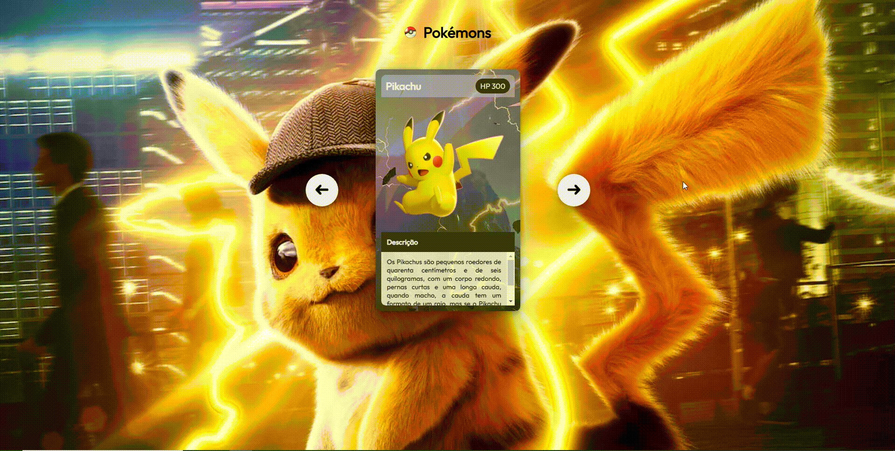

# Projeto - Pokemon
Um projeto que conta um pouco sobre o desenho do Pokemon, como também buscou demonstrar e descrever três personagens bem conhecidos e diferentes, tanto quanto suas habilidades e características. 🚀❤🙌

[]

# Personagens 😎😃🐲
Aqui estão listados os três personagens que descrevi para elaboração deste projeto...

## Pikachu
Os Pikachus são pequenos roedores de quarenta centímetros e de seis quilogramas, com um corpo redondo, pernas curtas e uma longa cauda, quando macho, a cauda tem um formato de um raio, mas se o Pikachu for fêmea sua cauda ganha um coração na ponta.

## Charizard
Geralmente, um Charizard é competitivo. Ele adora a batalha e seu espírito competitivo também é notável, uma vez que nunca vai cuspir fogo em um inimigo mais fraco a menos que provocado ou ordenado. Quando fica muito irritado, as chamas em sua cauda se tornam branco-azuladas.

## Mewtwo
Mewtwo foi criado geneticamente em um laboratório, sendo um clone do misterioso antigo Pokémon Mew. É uma criatura com uma postura humanóide, mas tem algumas características felinas.

## Tecnologias utilizadas 🚀
- HTML5
- CSS3
- JAVASCRIPT
- PHOTOSHOP

## Por que desenvolvi o projeto?
Este trabalho foi desenvolvido com o intuito de demonstrar minhas habilidades com a programação por meio de três personagens do desenho do Pokemon, dentro de cards. São eles o Pikachu, Charizard e Mewtwo, como também suas respectivas descrições e características. Inseri, como também elaborei sua arte e design utilizando o photoshop. Espero que curtem e ajude compartilhando!!!

Feito com ❤ por Flávio Dias Moreira 👏 [Veja meu LinkedIn](https://www.linkedin.com/in/fl%C3%A1vio-dias-moreira-89102a218/)